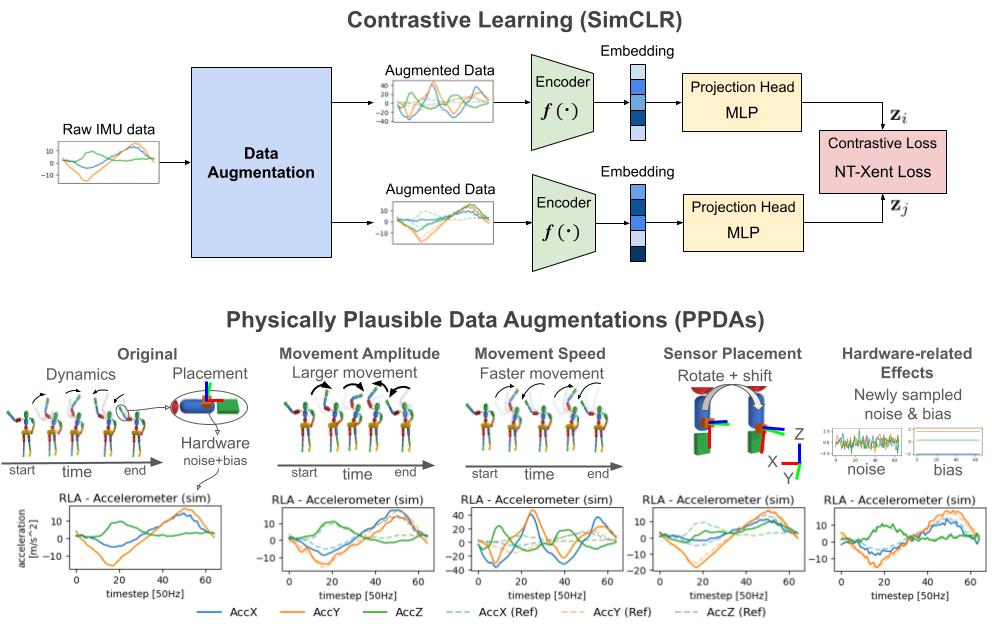

# Physically Plausible Data Augmentations in Contrastive Learning for Wearable IMU-based HAR

This repository contains the implementation of **Physically Plausible Data Augmentations (PPDA) in contrastive learning for wearable Inertial Measurement Unit (IMU)-based Human Activity Recognition (HAR)**

[📄 Read our paper (arXiv)](https://arxiv.org/abs/XXXX.XXXXX)  

---



*Figure: Contrastive learning with Physically Plausible Data Augmentations (PPDAs). PPDAs generate realistic variations (movement amplitude, speed, sensor placement, hardware effects) using physics simulation.*

## 📌 Introduction

This repository provides the official implementation of **Physically Plausible Data Augmentations (PPDA) in contrastive learning for wearable IMU-based Human Activity Recognition (HAR)**.

Recent work has shown that **contrastive self-supervised learning** (e.g., SimCLR) can learn strong representations from unlabeled sensor data. A key factor in its success is the use of **data augmentations** to create multiple views of the same signal. However, conventional **Signal Transformation-based Data Augmentations (STDA)** often rely on arbitrary signal distortions (e.g., jittering, random rotations), which can generate unrealistic samples and potentially break the semantic meaning of activities.

**Physically Plausible Data Augmentation (PPDA) [1]** overcomes these issues by using a **physics-based simulation framework (WIMUSim) [2]** to generate **realistic variations** in:

- **Movement Amplitude**
- **Movement Speed**
- **Sensor Placement**
- **Hardware-related Effects** (noise and bias)

By pretraining on PPDA-augmented views, our models achieve:

- **Higher downstream accuracy** across multiple HAR datasets (**REALDISP, REALWORLD, and MM-Fit**)  
- **Better label efficiency** (reaching supervised performance with <10% labeled data),

## ⚙️ Installation

### Prerequisites
- Python 3.10 or higher
- Git

1. **Clone this repository and WIMUSim repository**  
```bash
git clone https://github.com/USERNAME/PPDA_Contrastive.git
git clone https://github.com/STRCWearlab/WIMUSim.git
cd PPDA_Contrastive
```

2. **Install dependencies**
```bash
pip install -e WIMUSim
pip install -r requirements.txt
```

3. Configure environment variables
Set the `WANDB_ENTITY` environment variable to your Weights & Biases entity name.
```text
WANDB_ENTITY=`replace_with_your_wandb_entity`
```

4. **Prepare datasets**
Download datasets (REALDISP, REALWORLD, MM-Fit) as described in [data/README.md](data/README.md).

## 🧪 Running Scripts

### Comparing STDA vs PPDA (Section 4.2)
1. Single-augmentation experiment (e.g. MM-Fit dataset):
```bash
# PPDA with single augmentation (e.g., magscale only)
python simuclr_pt_ft_ppda.py --wandb \
                             --seeds 1 2 3 \
                             --pt_encoder DeepConvLSTM \
                             --dataset_name mmfit \
                             --pt_num_epochs 200 \
                             --ft_num_epochs 50 \
                             --first_augs magscale \
                             --magscale_sigma 0.2
                             
# STDA with single augmentation (e.g., magscale only)
python simuclr_pt_ft_ppda.py --wandb \
                             --seeds 1 2 3
                             --pt_encoder DeepConvLSTM \
                             --dataset_name mmfit \
                             --pt_num_epochs 200 \
                             --ft_num_epochs 50 \
                             --first_augs magscale \
                             --magscale_sigma 0.2
```

2. pairwise-augmentation experiment (e.g. MM-Fit dataset):
```bash
# PPDA with pairwise-augmentation (e.g., magscale and timewarp)
python simuclr_pt_ft_ppda.py --wandb \
                             --seeds 1 2 3
                             --pt_encoder DeepConvLSTM \
                             --dataset_name mmfit \
                             --pt_num_epochs 200 \
                             --ft_num_epochs 50 \
                             --first_augs magscale timewarp\
                             --magscale_sigma 0.2 \
                             --timewarp_max_speed_ratio 1.5 \
                             --timewarp_knot 4
                             
# STDA with pairwise-augmentation (e.g., magscale and timewarp)
python simuclr_pt_ft_ppda.py --wandb \
                             --seeds 1 2 3
                             --pt_encoder DeepConvLSTM \
                             --dataset_name mmfit \
                             --pt_num_epochs 200 \
                             --ft_num_epochs 50 \
                             --first_augs magscale timewarp \
                             --magscale_sigma 0.2 \
                             --timewarp_max_speed_ratio 1.5 \
                             --timewarp_knot 4
```

3. Multi-augmentation experiment (e.g. MM-Fit dataset):
Similar to the pairwise-augmentation experiment, enable multiple augmentations by listing them in `--first_augs`. For example, to combine **magnitude scaling, time warping, rotation, and noise/bias**:
```bash
--first_augs magscale timewarp rotation noisebias
```

### Label Efficiency Evaluation (Section 4.3)
To evaluate label efficiency, fine-tune a pretrained model with a fraction of labeled data (e.g., 10%):
```bash
python simuclr_ft.py --wandb \
                     --seeds 1 2 3
                     --pt_run_name ppda_magscale_020 \ # pretraining run name (used to find the pretrained model checkpoint)
                     --dataset_name mmfit \
                     --pt_encoder TPN \
                     --ft_num_epochs 50 \
                     --ft_adjust_epochs \
                     --ft_data_sample_type stratified \
                     --ft_data_fraction 0.1 \
````

## 📚 Links

- WIMUSim: [Paper](https://www.frontiersin.org/journals/computer-science/articles/10.3389/fcomp.2025.1514933/full), [GitHub](https://github.com/STRCWearlab/WIMUSim)
- PPDA: [Paper](https://www.arxiv.org/abs/2508.13284), [GitHub](https://github.com/STRCWearlab/PPDA)

## 🙏 Acknowledgements

Parts of this repository are adapted from [dl_har_public](https://github.com/STRCSussex-UbiCompSiegen/dl_har_public) and [soar_2024](https://github.com/ubicompsoartutorial/soar_2024).  
We thank the authors for making their code available.

## References
[1] Oishi, N., Birch, P., Roggen, D., & Lago, P. (2025). WIMUSim: simulating realistic variabilities in wearable IMUs for human activity recognition. Frontiers in Computer Science, 7, 1514933.

[2] Oishi, N., Birch, P., Roggen, D., & Lago, P. (2025). Physically Plausible Data Augmentations for Wearable IMU-based Human Activity Recognition Using Physics Simulation. arXiv preprint arXiv:2508.13284


